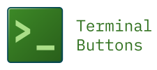

# Terminal Buttons

Adds buttons to the right hand side of the statusbar to run the Rename terminal command and the Show Terminal command.

Rename Terminal is only visible if terminals can be seen. If you close the terminals, there is no GUI way of showing the terminals view again - only the command to focus on the terminal view via the comman palette.

It is not possible with extensions to change the window menus so this extension will add a button to the status bar to show the terminal view.

## What's new in v1.1.0?

[See a video showcasing the changes](#)

- Added configuration for custom button labels
- Added a show terminals button.
- Renamed extension (key remains the same)

## Configuration

Setting      | Description                                 | Default Value | Type
------------ | ------------------------------------------- | ------------- | ------
Rename Label | An alternative label for the rename button. | -             | String
Shwo Label   | An alternative label for the show button.   | -             | String

## Translations

This extension is localised, if you want it in your language please send me a translated "package.nls.json" file which you can find in the root of this extension. Alternatively, fork the repository and create a PR with your translations.

## Support

If you use this plugin and want to help support development, please [PayPal Me](https://www.paypal.com/paypalme/stephenbungert).
